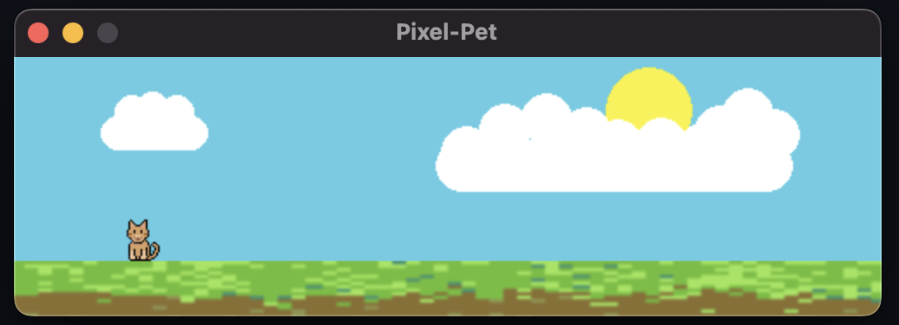

# Pixel-Pet


```
All assets are drawn by me (Systemized) via Aseprite

Pixel-Pet is a mini-project I made using Phaser.js, along with HTML and Typescript

Bundled with vite, and packaged using Tauri 2.0
```





## Prerequisites:

This code packages via Tauri, which is built on rust. Therefore [Rust](https://rustup.rs/) is required


Install Tauri CLI in terminal, using npm as the package manager

```bash
npm install -D @tauri-apps/cli@latest
```


## Installation:
    
1. Install dependencies 

```bash
npm install
```

2. Run or Build

- Run dev
```bash
npx tauri dev
```


- Build app
```bash
npx tauri build
```